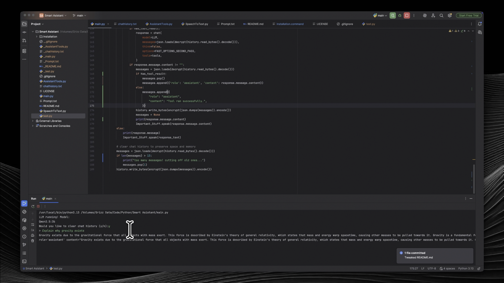

# Kario



Kario is a smart assistant powered by [Ollama](https://ollama.com). I built it to replace Siri.
The project is still in active development, so expect bugs and sometimes frequent model changes.

## Installation

Before installing, make sure you have:

- Python 3.13 (recommended, but python 3.9.x+ should work)
- [Ollama](https://ollama.com)

I currently test on Apple Silicon only. Windows and Linux is not officially supported yet, and some features require
code changes
to work there.

### Recommended Hardware (Tested on M4 with 16GB RAM)

- Apple Silicon (M3 or M4 for decent speed, M5 and future models are supported)
- 16 GB RAM, 8 GB RAM is most likely the bare minimum you can use

You can change the Ollama model if you want. For speed, I recommend models between 1B and 4B parameters. Also, if you
use Intel Macs, expect it to be ***VERY*** slow.

## Setup Steps

1. Download installation.command from the repository.
2. Double-click the file, making sure you are on macOS. This will clone the Git and install necessary packages, usually
   at your home folder. Navigate to the desired folder to clone to by doing `cd /path/to/your/clone/destination/`. Make
   sure to replace that path with where you actually want the project to be.
3. Make sure Ollama is running by running the following command:

```sh
ollama serve
```

If you are trying to run the setup file on windows, please note that the `.command` file type is macOS exclusive.
Instead, copy and paste the commands in the file to your terminal. You should be able to open the `.command` in any
boring
text editor and the commands should work on windows or linux decently, too.

## How to use

Run the command above, and just say "Hey computer" or "Computer" and then continue the rest of your prompt. There is
currently no GUI, as I want the whole thing to be voice-oriented like Alexa or Siri. Also, please note the wake word
detection is just seeing if the wake word is in the prompt, so it may not be totally accurate. If you wish to block
apple automation of all kinds, set `Testing_automation` to `True` in `AssistantTools.py`. This will block all
applescript besides speech, while still allowing the LLM to use the functions if you wish to experiment. If you wish to
not speak, set `Can_speak` to `False` in `main.py`. This will rely on you typing in the python console to speak to the
assistant, and while using this you do not have to include "Hey computer" or "Computer".

## Features

### What's unique:

- Uses an LLM rather than basic if-else parsing, allowing for more flexible and natural sounding commands as well as
  some basic logic and chatting ability
- A lot of it is local, as it only uses internet for weather, web search, FaceTime / FaceTime audio (can be automated
  without internet but requires internet to use), and potentially iMessage if it is not using SMS.

### What it can do:

- It can search the web for accurate / up-to-date info
- It can provide a weather forecast
- It can manage timers (decently)
- It can call or text (with AppleScript automation, it may ask for permissions the first time)
- A lot of the features are local
- No API key or paid program required for the built-in features

## Notes

- The default model may change over time.
- Keep at least 5 GB of free disk space for local model files.
- macOS-only features currently include `say`, `osascript`, Contacts, Messages, FaceTime, and Spotify automation.
- Remove the class `Apple_Integration` in `AssistantTools.py` and rewrite the `speak` function in `AssistantTools.py` if
  you would like to make the whole thing cross-compatible. I suggest you take the 10 minutes of removing
  it all, as I do not have a Windows or Linux PC to test on and the time to manage a separate repository.
- Expect frequent changes as I work on this code **A LOT**.
